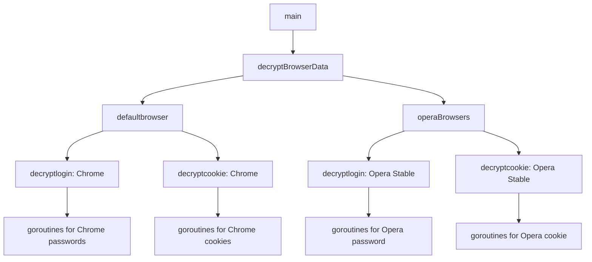

# blazing extraction
blazingly fast multithreaded browser extraction made in golang

CHECKLIST:
- [x] Password Extraction
- [x] Cookie Extraction
- [ ] Credit Card Extraction
- [ ] Crypto Wallet Extraction
- [ ] Token Extraction
- [ ] History Extraction

## Test Usage


**Execution time: 4.6836ms**

**Entries Decrypted: 107**


**Execution time: 453ms**

**Entries Decrypted: 4071**

My CPU:
Ryzen 5 7500F 6-Core processor

Compared to other extractors that takes almost a minute to decrypt my passwords and cookies entries, this took under half a **second**.


# How to use? 
download the precompiled binary in the release folder (currently only x86_64, cuz i aint cross compiling, build it yourself)

### decrypt both passwords and cookies
```
.\browser.exe
```

### decrypt passwords only
```
.\browser.exe --passwords
```

### decrypt cookies only
```
.\browser.exe --cookies
```


# How to build? 
1. install gcc and golang 
2. git clone the repo
3. go mod init 
4. go mod tidy
5. go env -w CGO_ENABLED=1
6. go env -w GOOS=windows
7. go build -ldflags "-s -w" browser.go

binary will be in current directory

# For the Nerds

This extraction tool makes full use of goroutines and channels to achieve high parallelism.

## Parallelism Structure

### 1. Top-level parallelism

The program splits into two main concurrent paths:
- One for default browsers
- One for Opera browsers

These run in parallel.

### 2. Browser-level parallelism

For each browser type (Chrome, Edge, Brave, etc.), the program creates separate goroutines for:
- Password decryption
- Cookie decryption

These run in parallel for each browser.

### 3. Entry-level parallelism

For each password and cookie entry within a browser, a new goroutine is spawned. This is where the parallelism can become very high.

> **Note**: Future improvement could involve creating a customizable pool instead of spawning a goroutine for each entry.

## Parallelism Diagram



## Limitations
Due to its very high parallism usage, it will consume a lot of resources if the target has many entries, especially when decrypting cookies.
(if you just want the passwords, just use --passwords.)
